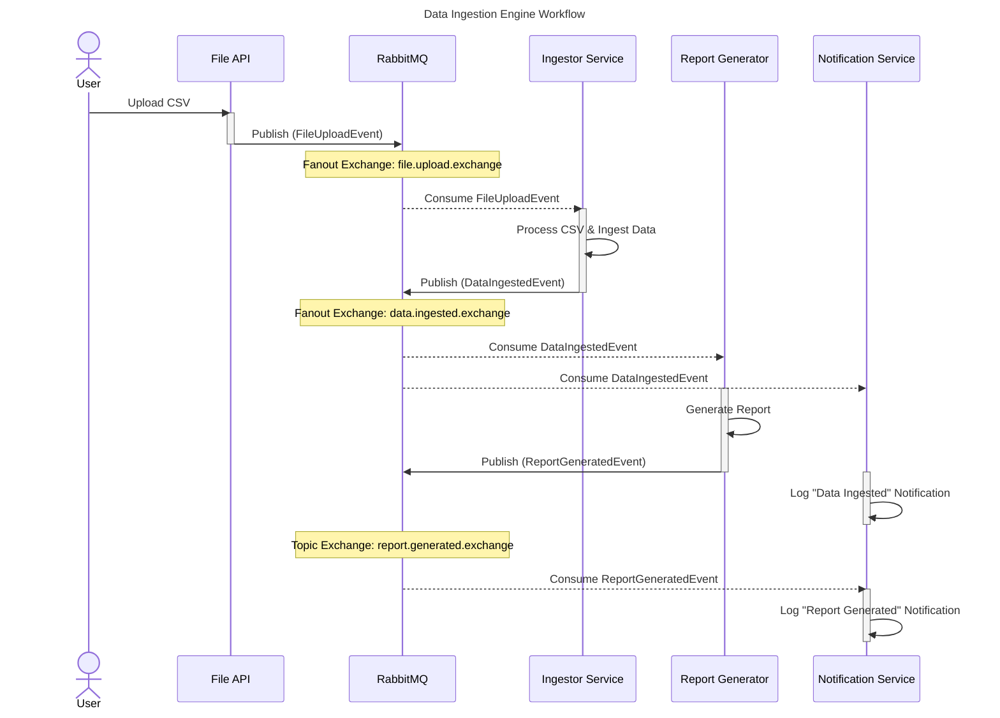

# Data Ingestion Engine

The **Data Ingestion Engine** is a distributed system built on a microservices architecture that demonstrates an event-driven workflow for processing data from CSV file uploads. This project is designed as a portfolio piece to showcase expertise in Spring Boot, RabbitMQ, Docker, and data pipeline management.

## 🚀 Key Technologies
-   **Spring Boot**: For building the microservices.
-   **RabbitMQ**: The messaging broker for asynchronous communication.
-   **Docker & Docker Compose**: To containerize and orchestrate all services and dependencies.
-   **PostgreSQL**: The database for both configuration and ingested data.
-   **Liquibase**: For database schema migration and management.

---

## 🏗️ Architectural Overview
The system is composed of several microservices, each with a single responsibility. Communication between services is handled asynchronously through RabbitMQ exchanges and queues, following a publish-subscribe model.

### Workflow Diagram



## 🧠 Workflow Explanation

The workflow is triggered by a file upload and is managed by a series of events and message passing.

### Phase 1: File Upload & Event Broadcasting

1.  A user uploads a CSV file via a REST API endpoint on the **`file-upload-api`**.
2.  The `file-upload-api` saves the file to a **temporary local directory**.
    *   *Note: In a production-grade application, this would be replaced by a robust, scalable cloud storage solution like Amazon S3 or Google Cloud Storage.*
3.  It then publishes a **`FileUploadEvent`** message to a RabbitMQ **fanout exchange** (`file.upload.exchange`).
4.  The fanout exchange broadcasts this single event to all bound queues, delivering a copy to the `ingestor-service`.

### Phase 2: Data Ingestion

1.  The **`ingestor-service`** consumes the `FileUploadEvent` from its queue.
2.  It uses the event metadata (specifically a `jobId`) to query the **`configuration-service`** for the dynamic data mapping rules.
3.  Using this configuration, the `ingestor-service` processes the CSV file from the local path and **ingests** the data into the appropriate table in the `ingestion` PostgreSQL database.
4.  Upon successful ingestion, the `ingestor-service` publishes a new **`DataIngestedEvent`** to a **fanout exchange** (`data.ingested.exchange`). This exchange broadcasts the event to both the report generator and the notification service.

### Phase 3: Reporting & Final Notifications

The `DataIngestedEvent` is consumed by two services in parallel:

1.  The **`report-generator-service`** consumes the event and performs its main task, which is simulating the generation of a report. After completing its work, it publishes a final **`ReportGeneratedEvent`** to a **topic exchange** (`report.generated.exchange`).
2.  The **`notification-service`** also consumes the `DataIngestedEvent` and logs an initial notification, confirming that the data has been successfully ingested.
3.  Finally, the **`notification-service`** consumes the `ReportGeneratedEvent` from the topic exchange and logs a final notification, signaling that the entire workflow is complete.

---

## ▶️ How to Run the Project

Follow these steps to run the infrastructure and microservices to test the full data ingestion workflow.

### Prerequisites
*   Java 21 or later
*   Apache Maven
*   Docker and Docker Compose

### Step 1: Start the Infrastructure

First, start the required infrastructure services (RabbitMQ and the two PostgreSQL databases).

1.  Open a terminal and navigate to the root directory of the project.
2.  Run the following command to start the containers in detached mode:
    ```sh
    docker compose up -d
    ```
3.  Wait a few moments for the databases and message broker to initialize. You can check their status with `docker compose logs -f`.

### Step 2: Start the Microservices

The microservices are not containerized yet and must be run individually from your IDE or the command line.

**Important:** You should start the services in the following order to ensure that dependencies are available when needed (e.g., the `configuration-service` should be running before the `ingestor-service` tries to call it).

1.  **`configuration-service`** (on port 8081)
2.  **`file-upload-api`** (on port 8080)
3.  **`ingestor-service`** (on port 8082)
4.  **`notification-service`** (on port 8083)
5.  **`report-generator-service`** (on port 8084)

You can run each service by:
*   **From your IDE:** Opening the main application class (e.g., `ConfigurationServiceApplication.java`) and running it.
*   **From the command line:** Navigating to the service's module directory (e.g., `cd configuration-service`) and running `mvn spring-boot:run`.

### Step 3: Perform the File Upload

Once all services are running, you can trigger the workflow by uploading the sample data file.

#### Option A: Using `curl`

You can use the following command from the project root to upload the file.

**Example `curl` command (run from the project root):**
```sh
curl --location 'http://localhost:8080/api/v1/upload' \
--form 'file=@"./dummy-sales-data.csv"' \
--form 'jobId=a0eebc99-9c0b-4ef8-bb6d-6bb9bd380a11'
```

#### Option B: Using the Swagger UI

The `file-upload-api` includes Swagger UI for interactive API documentation and testing. This is a user-friendly alternative to using `curl`.

1.  **Access the UI:** Once the `file-upload-api` is running, open your web browser and navigate to:
    [http://localhost:8080/swagger-ui/index.html](http://localhost:8080/swagger-ui/index.html)

2.  **Find the Endpoint:** You will see the `FileUploadController` and its `POST /api/v1/upload` endpoint.

3.  **Execute the Request:**
    *   Expand the endpoint details.
    *   Click the "Try it out" button.
    *   Use the "Choose File" button to select the `dummy-sales-data.csv` file from your project root.
    *   Enter `a0eebc99-9c0b-4ef8-bb6d-6bb9bd380a11` into the `jobId` field.
    *   Click the "Execute" button to send the request.

### Step 4: Observe the Workflow

*   **Check Logs**: Monitor the console output from each of your running services in your IDE. You will see logs from each service as the message passes through the pipeline.
*   **Database Verification**: Connect to the `ingestion` PostgreSQL database (on port `5433`) and check the `sales_orders` table to confirm the data was ingested correctly.
*   **RabbitMQ Management UI**: Access the RabbitMQ Management UI at `http://localhost:15672/` (Default credentials: `myuser`/`secret`) to see the exchanges, queues, and message flow.

---

## 🔮 Future Improvements

This project serves as showcase of event-driven workflow and is not exhaustive in its production-ready features. Future enhancements could include:

-   **Better Error Handling:** Implementing more robust error handling strategies, such as dead-letter queues (DLQs) in RabbitMQ to handle messages that cannot be processed.
-   **Integration Tests:** Adding a comprehensive suite of integration tests using libraries like Testcontainers to validate the end-to-end workflow.
-   **Dockerize All Microservices:** Containerizing each Spring Boot microservice and adding them to the `docker-compose.yaml` file for a fully orchestrated, single-command startup.
